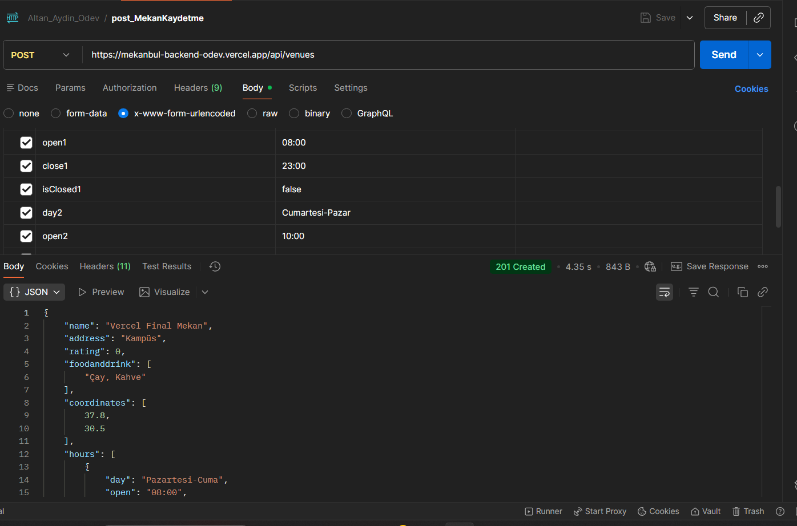
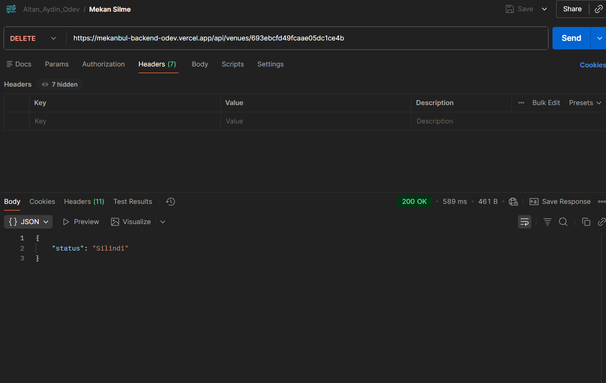
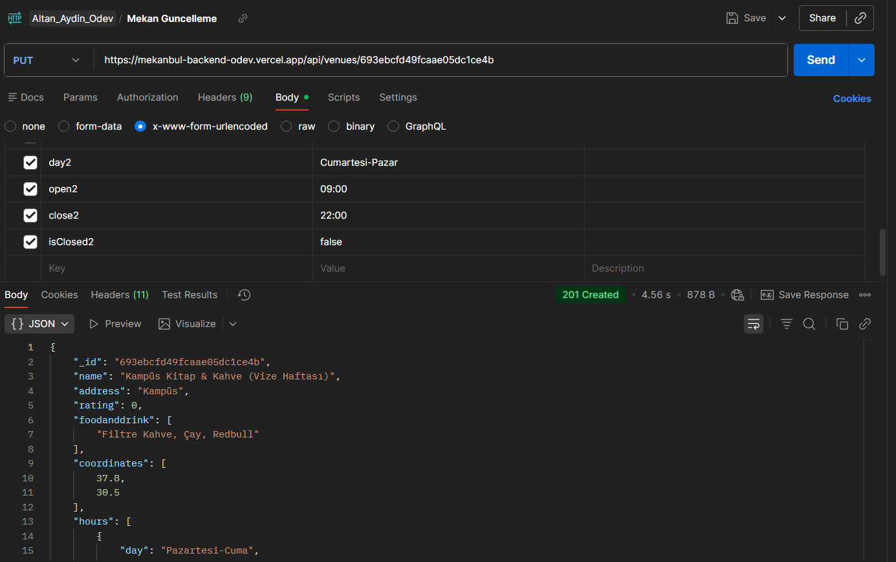
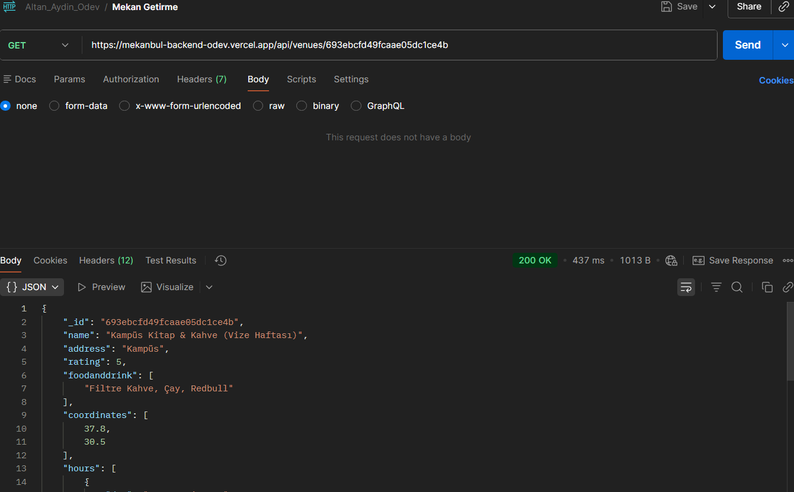
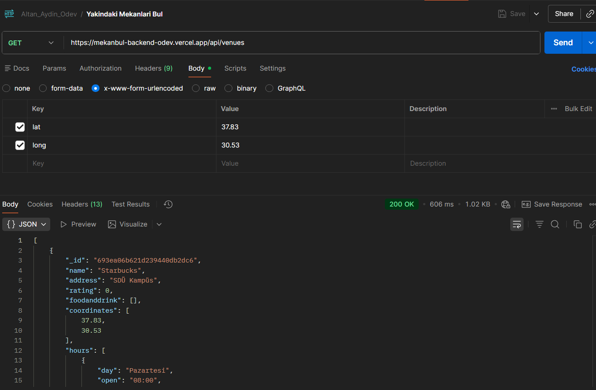
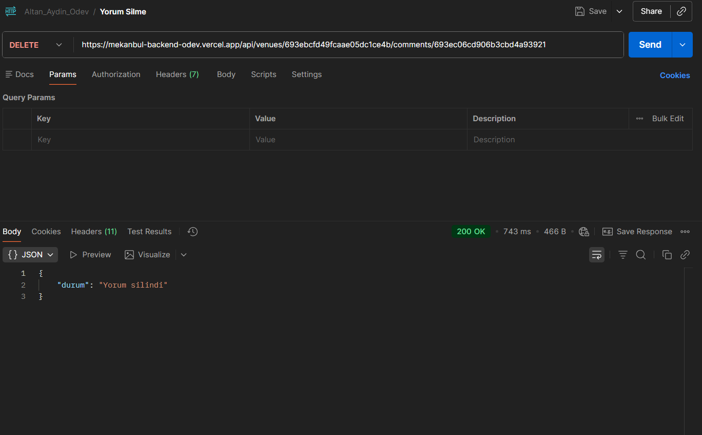
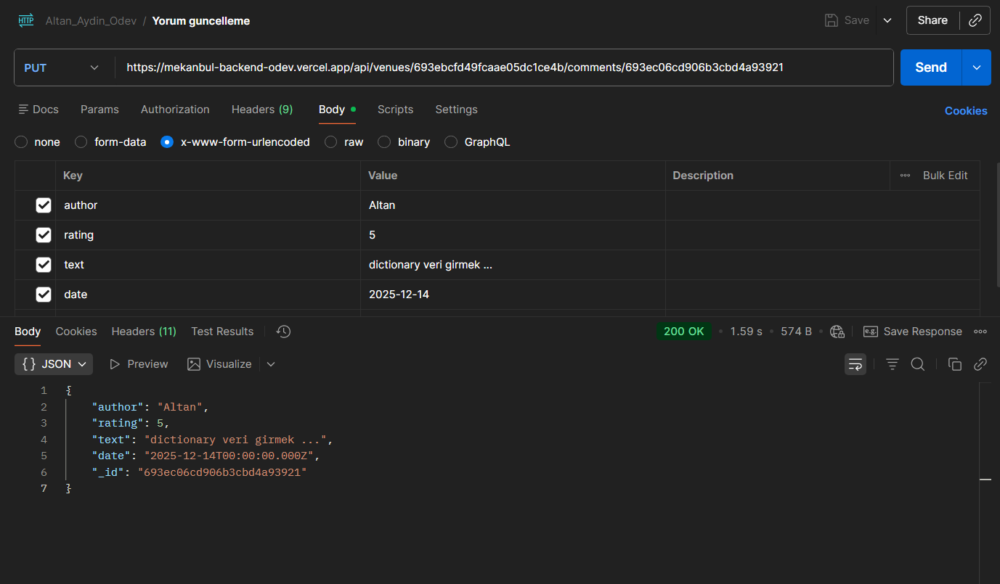
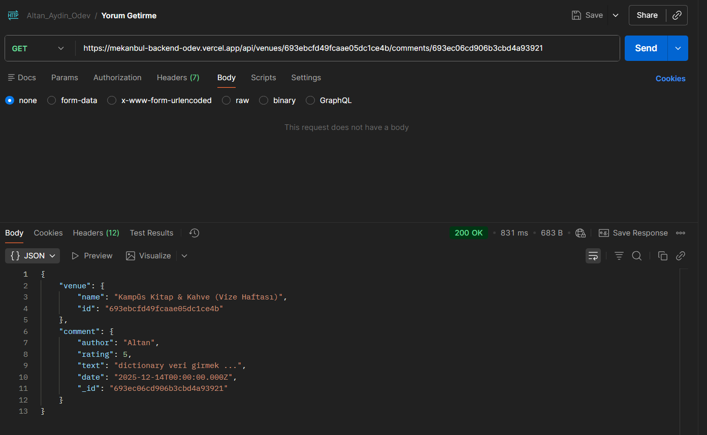

[Vercel bağlantısı](https://mekanbul-backend-odev.vercel.app/)

**API Endpoints**
- Tüm Mekanları listele: `GET /api/venues`
- Yeni Mekan Ekle: `POST /api/venues`
- Mekan Detayını Getir: `GET /api/venues/:venueid`
- Mekanı Güncelle: `PUT /api/venues/:venueid`
- Mekanı Sil: `DELETE /api/venues/:venueid`
- Yorum Ekle(Mekana): `POST /api/venues/:venueid/comments`
- Yorum Getir: `GET /api/venues/:venueid/comments/:commentid`
- Yorum Güncelle: `PUT /api/venues/:venueid/comments/:commentid`
- Yorum Sil: `DELETE /api/venues/:venueid/comments/:commentid`

**Postman ekran görüntüleri**
### Mekan İşlemleri

### Yorum İşlemleri

